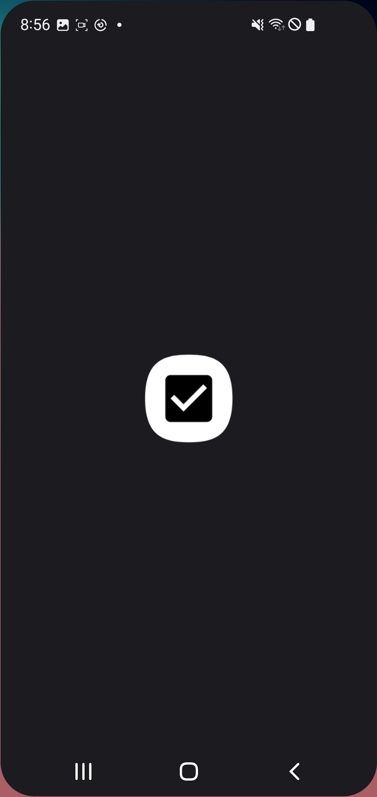
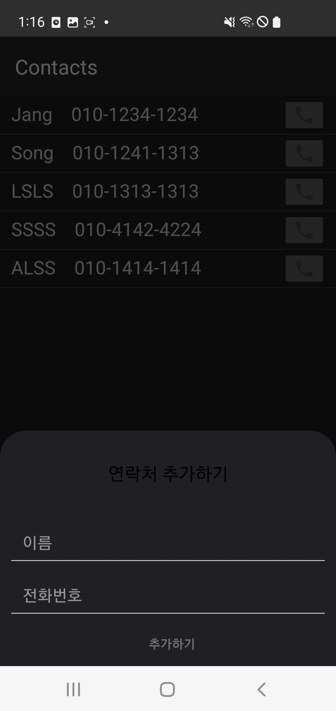
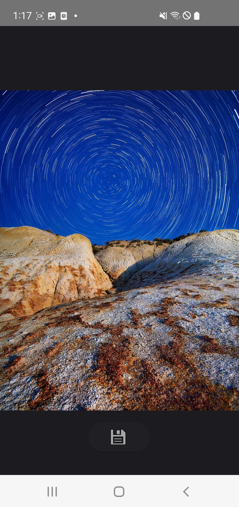

# molcamp_week_1

> 👍 서로 함께 공통의 과제를 함으로써, 개발에 빠르게 익숙해지기
>
> To become familiar with development by working on a common assignment together.

## Target Output -> :computer: Android Application Development by Kotlin
 
- [x] Building My Contacts.
- [x] Building My Image Gallery.
- [x] Free topic. In our case, Wise Sayings Generator(Kor).


## Table of Contents

- [Project Description](#project-description)
- [Features](#features)
- [Installation](#installation)
- [Usage](#usage)
- [Contributing](#contributing)

## Project Description

Brief overview and descriptions of our project.

| Loading Page                 |
| ---------------------------- |
||

### Tab 1 : Contacts
  

### Tab 2 : Gallery             
  


### Tab 3 : Wise Sayings Generator                   
 

everytime the screen is clicked new wise sayings are generated from APIs from https://api.qwer.pw/.


## Features

<br/>Main Activity<br/>
We used navgationcontroller to make three tabs in bottom. It is 'Phone, gallery, Wise Saying'

<br/>Phone<br/>
We used Relativelayout to put floating action button and recyclerview in one page.
In recyclerview, we put phonedata having 'name' and 'phoneNum'. 
<br/>

<br/>
one item of recyclerview is like this.

and if We push FAB(Floating Action Button), the bottom sheet appears to add contact.
<br/>
<br/>
This is a capture of bottom sheet. <br/>
We can click 'ic_phone' to change our phone into calling page.

<br/>Gallery<br/>


<Wise Saying>
  
## Installation

Nothing Special
Clone and Build project in Android Studio.
```
npm install
```

## Usage
if we want to put initial data into application, we can modify 
'''
    private val dataList = mutableListOf(
        PhoneData("Jang", "010-1234-1234"),
        PhoneData("Song", "010-1241-1313"),
        PhoneData("LSLS", "010-1313-1313"),
        PhoneData("SSSS", "010-4142-4224"),
        PhoneData("ALSS", "010-1414-1414")
    )
'''
in java>ui>phone>Phonefragment.kt

Provide examples or instructions on how to use your project. Include code snippets or screenshots if applicable. Explain any relevant details that users need to know to use your project effectively.

## Contributing

Explain how others can contribute to your project. Include guidelines for submitting bug reports, feature requests, or pull requests. Specify any coding styles, conventions, or standards that contributors should follow.

## Acknowledgments

If your project builds upon or uses external resources or libraries, acknowledge and give credit to those sources here.
picasso

## Contact

Doyoon Song(sd990307@gm.gist.ac.kr)
Dongwoo Jang(peter010617@gmail.com)
[https://doyoonsong.vercel.app](https://doyoonsong.vercel.app/)


